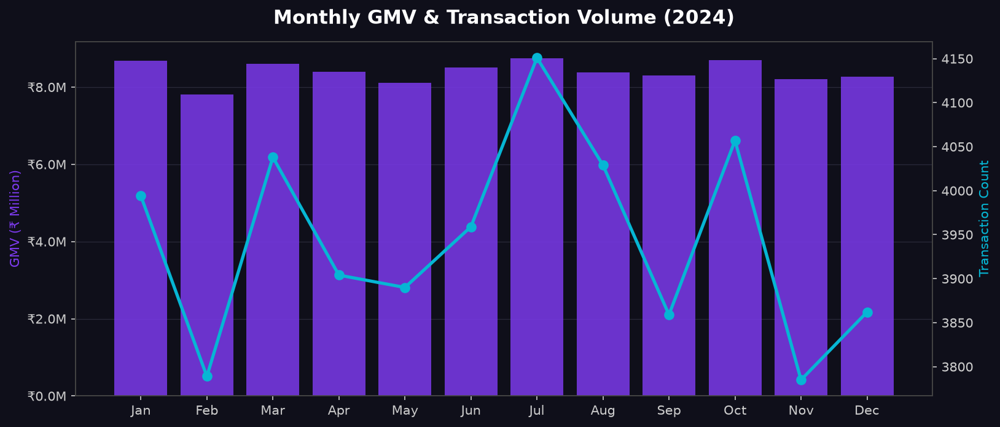
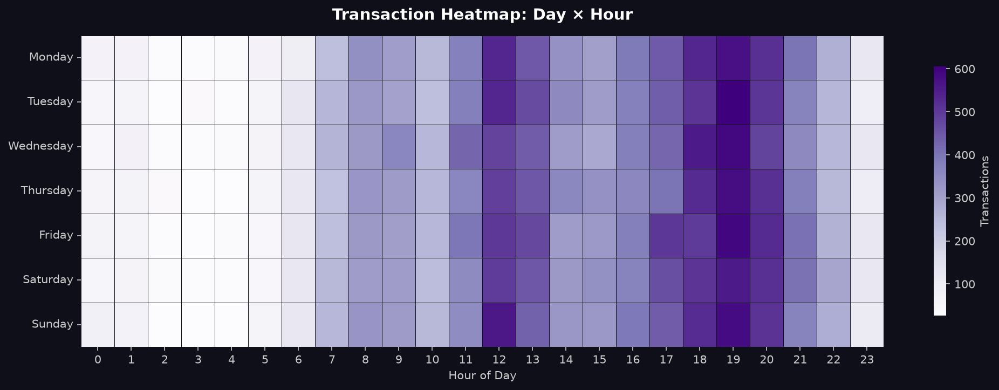
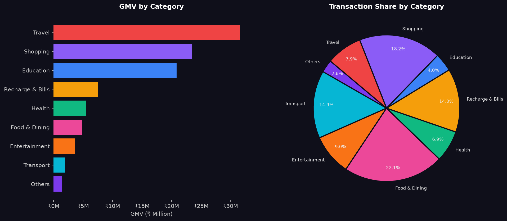

# 💳 Digital Payment Transaction Analytics

An end-to-end analytics project simulating a **PhonePe / UPI-style payment platform** — covering data generation, exploratory data analysis, business KPI tracking, and an interactive dashboard.

---

## Overview

| Metric | Value |
|--------|-------|
| Transactions Analyzed | 50,000 |
| Users | 5,000 |
| Total GMV | ₹10.07 Crore |
| Success Rate | 94.6% |
| Time Period | Jan 2024 – Dec 2024 |

---

## Tech Stack


---

## Features

- **Synthetic Dataset Generation** — Realistic UPI transaction data across 9 categories, 5 payment methods, 10 cities, and 5 age groups
- **Exploratory Data Analysis** — Monthly GMV trends, category breakdown, city performance, demographic cohorts, hourly heatmaps
- **Interactive Dashboard** — Streamlit + Plotly dashboard with live filters (city, category, payment method, quarter)
- **Business Insights** — KPIs, top merchants, payment failure rates, amount distribution

---

## Charts Generated

| # | Chart |
|---|-------|
| 1 | Monthly GMV & Transaction Volume Trend |
| 2 | Category-wise GMV & Transaction Share |
| 3 | Payment Method Performance & Failure Rate |
| 4 | Transaction Heatmap — Hour × Day of Week |
| 5 | City-wise GMV & GMV per User |
| 6 | Spending by Age Group & Gender |
| 7 | Transaction Amount Distribution & Percentile Curve |
| 8 | Quarterly GMV Growth |
| 9 | Top 15 Merchants by GMV |

---

## Project Structure

```
payment-analytics/
│
├── generate_data.py      # Generate 50K synthetic transactions
├── analysis.py           # Full EDA — saves 9 charts to charts/
├── dashboard.py          # Streamlit interactive dashboard
├── requirements.txt      # Dependencies
└── charts/               # Generated chart images
```

---

## Getting Started

```bash
# 1. Clone the repo
git clone https://github.com/Satyam-344/payment-analytics.git
cd payment-analytics

# 2. Install dependencies
pip install -r requirements.txt

# 3. Generate the dataset
python generate_data.py

# 4. Run EDA and save charts
python analysis.py

# 5. Launch the interactive dashboard
streamlit run dashboard.py
```

---

## Key Insights

- **Travel** drives highest GMV despite being only 8% of transaction volume — high-value, low-frequency
- **UPI dominates** with 54.8% of all transactions
- **Peak hour is 7 PM** — evening spike across all categories
- **Top 5% of transactions** account for 31.4% of total GMV (Pareto effect)
- **Net Banking** has the highest failure rate (~9%) — biggest UX improvement opportunity
- **Mumbai** leads in GMV; **Bangalore** leads in GMV per active user

---

## Dashboard Preview




